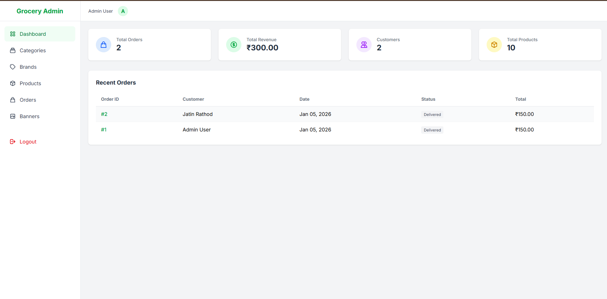

# 🛒 Antigravity E-Commerce

A modern, full-featured e-commerce platform built with Laravel. This project provides a robust solution for managing online stores, featuring a comprehensive admin panel and a seamless customer shopping experience.

---

## ✨ Features

### 🛍️ Frontend (Customer)
*   **User Authentication**: Secure Login & Registration.
*   **Product Browsing**: Filterable product listings and detailed product views.
*   **Shopping Cart**: Fully functional cart management (Add, Update, Remove).
*   **Checkout Logic**: Streamlined checkout process.
*   **User Dashboard**: View order history and manage account details.
*   **Static Pages**: About Us, Contact Us, Terms of Service.

### 🛠️ Backend (Admin)
*   **Dashboard**: Overview of store performance.
*   **Product Management**: Create, edit, and delete products (CRUD).
*   **Category & Brand**: Organize products with hierarchical categories and brands.
*   **Order Management**: View user orders.
*   **Banner Management**: Dynamic banner control for the frontend.

---

## 📸 Screenshots

### Home Page


### Product Detail


### Admin Dashboard


---

## 🚀 Installation

Follow these steps to set up the project locally:

1.  **Clone the repository**
    ```bash
    git clone <repository-url>
    cd antigravity
    ```

2.  **Install PHP Dependencies**
    ```bash
    composer install
    ```

3.  **Install NPM Dependencies**
    ```bash
    npm install && npm run build
    ```

4.  **Environment Setup**
    Copy the example env file and configure your database creds.
    ```bash
    cp .env.example .env
    php artisan key:generate
    ```

5.  **Database Migration**
    ```bash
    php artisan migrate
    ```

6.  **Run the Application**
    ```bash
    php artisan serve
    ```

---

## 💻 Tech Stack

*   **Framework**: [Laravel](https://laravel.com)
*   **Frontend**: Blade Templates, Bootstrap
*   **Database**: MySQL / SQLite
